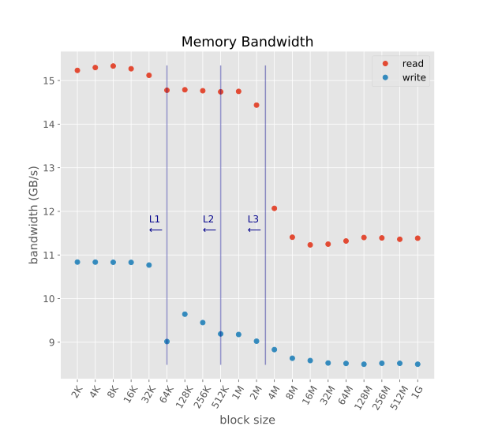
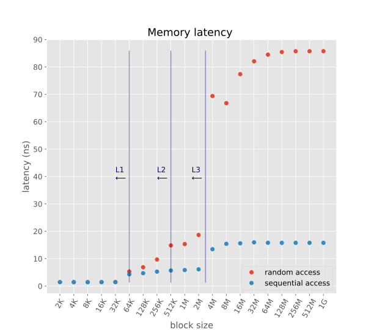

Low Level Memory Benchmark
=====================

These are the results of a low level memory benchmark (written in C) on my laptop.

Laptop manufacturer specs:

  - Lenovo - T460
  - CPU i5-6200U: 2.3GHz (0.43 ns per cycle) (2 cores with hyperthreading)
  - L1 64 KB, hit rate 4 cycles = 1.72 ns
  - L2 512 KB, hit rate 10 cycles = 4.3 ns
  - L3 3072 KB, hit rate 40 cycles = 17.2 ns
  - RAM DDR3-3200: 32GB, 1600 MHz (1.25 ns per cycle), CAS Latency 16 cycles, Total latency = CAS latency x cycle = 16*1.25 = 20 ns, Throughput 25.6 GB/s

Benchmarks run using the software [lmbench](http://www.bitmover.com/lmbench/).

Results:

  - [memory read bandwidth](memory_read_bandwidth.csv)
  - [memory write bandwidth](memory_write_bandwidth.csv)
  - [memory sequential access latency](memory_seq_latency.csv)
  - [memory random access latency](memory_random_latency.csv)

Summary Plots:

